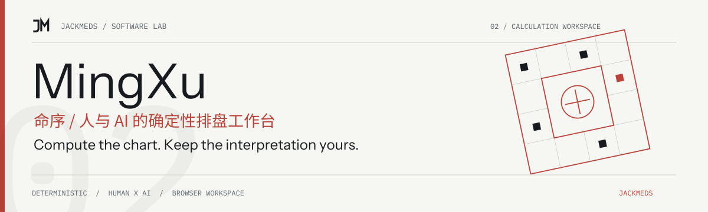
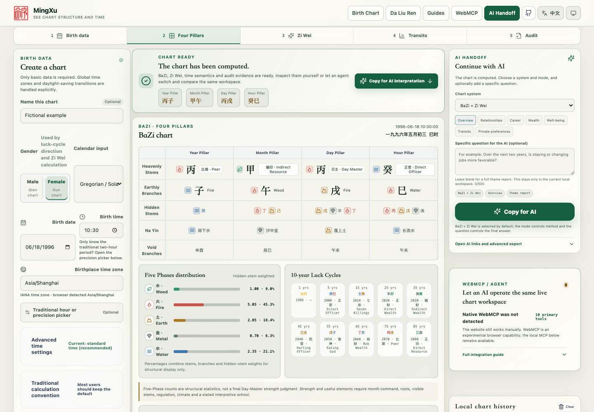

<!-- jackmeds-brand:start -->
<picture>
  <source media="(prefers-color-scheme: dark)" srcset="assets/brand/hero-dark.svg">
  
</picture>
<!-- jackmeds-brand:end -->

# MingXu / 命序

**Deterministic chart computation. A shared workspace for people and AI agents.**

MingXu calculates BaZi (Four Pillars), Zi Wei Dou Shu, Da Liu Ren, transits and apparent solar time with reproducible code. Explore the same visible chart with an agent, then interpret the evidence with the AI you choose.

[Open the workspace](https://astrocopy.jackmeds.top/) · [中文说明](README.zh-CN.md) · [Agent setup](https://astrocopy.jackmeds.top/agents.md)



[Screenshot provenance](docs/brand-proof.md). The image shows the currently deployed workspace; it does not simulate an Agent session.

## Try it

1. Open the workspace and load the built-in example, or enter birth date, time and IANA time zone.
2. Inspect the BaZi, Zi Wei, transit or calculation-audit view.
3. Export Markdown, plain text or JSON. A compatible WebMCP agent can operate this same workspace.

The example chart uses demo input. The app shows structural facts, warnings and cross-check differences.

## What you can do

- Compute BaZi pillars, 10-year luck cycles, annual/monthly transits and explicit relation facts.
- Explore normalized Zi Wei palaces, stars and dynamic scopes.
- Cast complete Da Liu Ren charts using actual time, a reported number or a selected hour branch.
- Compare two to five dates with a person and an agent sharing visible state and undoable activity.
- Audit civil time, longitude correction, apparent solar time, DST and cross-engine differences.

See the [technical overview](docs/technical-overview.md) for calculation coverage, time semantics and validation engines.

## Quick start

Requires Node.js 24 and npm.

```bash
git clone https://github.com/JackMeds/sizhu-astro-ai.git
cd sizhu-astro-ai
npm ci
npm run dev:web
```

For a local stdio MCP client:

```bash
npm run build:mcp
npm run start:mcp
```

The canonical namespace is `mingxu.*`. Existing `sizhu.*` and `astrocopy.*` aliases and both `mingxu-mcp` / `sizhu-mcp` executables remain compatible. [HTTP MCP setup](docs/remote-mcp.md) documents the deployment target at `https://mcp.jackmeds.top/mcp`.

## Privacy and limits

Birth-chart and casting calculations run in the browser. Drafts and up to 12 history records stay in that browser unless you explicitly export or share them. The website does not automatically send birth data to an AI provider. Agent calls or copied exports share data with the service you choose.

[Local backup and import](https://astrocopy.jackmeds.top/backup/) transfers history, draft, theme and language using a private JSON file. Existing destination data wins conflicts. Keep the original file: records beyond the 12-item limit remain there. The [old-origin recovery page](https://astrocopy.jackmeds.top/migration/) stays export-only.

MingXu is a traditional-culture research and software tool. It makes no claim of scientific predictive validity and does not replace medical, legal, financial or other professional advice. Results retain the original AstroCopy engine identities.

## Development and documentation

```bash
npm test
npm run test:migration
npm run typecheck
npm run build
```

- [Architecture and calculation details](docs/technical-overview.md)
- [Agent guide](https://astrocopy.jackmeds.top/agents.md) · [Learning guides](https://astrocopy.jackmeds.top/guide/)
- [Migration, compatibility and rollback](docs/mingxu-migration.md)
- [Report an issue](https://github.com/JackMeds/sizhu-astro-ai/issues)

Internal packages now use `@mingxu/*`; private `@sizhu/*` forwarding workspaces remain through at least the next stable release. This preparation does not publish packages or change the live domain.

Licensed under [GPL-3.0](LICENSE).
